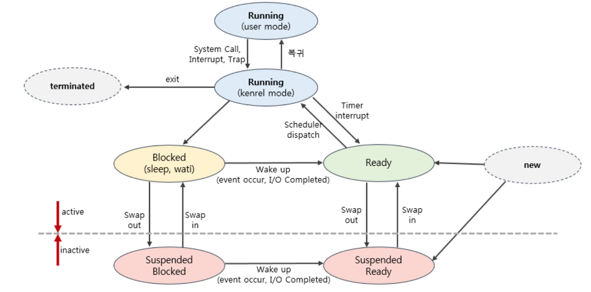

# 프로세스 스케줄러

- 스케줄러의 종류는 단기, 중기, 단기로 존재합니다.

### 1. 프로세스의 상태

- **new : 프로세스 생성중**
  - 프로세스를 생성하고 있는 단계로 커널 공간에 PCB가 만들어진 상태
- **ready : 프로세스가 CPU를 기다리는 상태**
  - 프로세스가 메모리에 적재된 상태로 실행하는데 필요한 자원을 모두 얻은 상태
  - 아직 CPU를 받지는 않았지만 CPU를 할당 받으면 바로 실행 가능한 상태
  - ready상태를 가지는 여러개의 프로세스들이 존재할 수 있습니다.
- **running : 프로세스가 CPU를 할당받아 명령어를 수행중인 상태**
  - 일반적으로 CPU가 하나이기 때문에, 여러 프로세스가 동시에 실행되도 실제로 실행중인 프로세스는 매 시점 하나 뿐입니다.
- **blocked : 프로세스가 CPU를 할당 받아도 당장 실행할 수 없는 상태**
  - 현재 프로세스가 I/O작업 등을 을 처리중 상태를 의미
- **terminated : 프로세스의 실행 종료**
  - 프로세스의 실행이 완료되고 할당된 CPU를 반납, 커널공간내의 PCB는 남아 있습니다.
- **suspended : 프로세스의 중지 상태**
  - 메모리를 강제로 뺏긴 상태로 특정한 이유로 프로세스의 수행이 정지된 상태를 의미하며, 외부에서 다시 재개시키지 않는 이상 다시 활성화 될 수 없습니다.
  - 중기 스케줄러에 의해 디스크로 스왑 아웃된 프로세스의 상태가 대표적인 suspenden상태라 할 수 있습니다. 
  - suspended ready : 준비 상태에 있던 프로세스가 디스크로 스왑아웃
  - suspended blocked : 봉쇄 상태에 있던 프로세스가 디스크로 스왑아웃

- blacked란?

  - 프로세스 A가 CPU를 할당받고(running상태) 명령어를 실행하다 I/O 작업을 해야 하는 경우, 디스크 I/O 작업은 CPU 처리 속도에 비해 오래 걸리는 작업이기 때문에 디스크 I/O 작업 동안은 CPU를 점유하고 있어도 다음 명령어를 수행하지 못하게 됩니다. => CPU 낭비
  -  때문에 디스크 I/O 작업을 하는 프로세스는 CPU를 반납하고 장치 큐에가서 줄을 서게 됩니다 => blocked 상태 
  - 이후 디스크 컨트롤러에 의해 서비스를 받아 일을 수행하면 디스크 컨트롤러가 CPU에게 일을 끝났음을 알립니다. => 인터럽트 
  - 이후 프로세스 A는 장비 큐에서 빼내어 준비큐로 넣어주고 프로세스 A가 한 일(로컬버퍼에 저장)은 메모리에 올라가게 됩니다.

- ※ blocked 와 suspended의 차이

  - blocked : 잠시 중지되어있다(blocked) 끝나면 다시 ready상태로 돌아오게 됩니다.

  - suspended : 잠시 중지되어 있다(suspendedn) 누군가가 재개시켜줘야 다시 ready상태로 돌아오게 됩니다.

### 2. 프로세스를 스케줄링 하기 위한 큐

- **작업큐(Job Queue)**

  - 시스템의 모든 프로세스를 관리하기 위한 큐로 프로세스의 상태와 무관하게 현재 시스템 내에 있는 모든 프로세스를 관리합니다. 
  - 그렇기 때문에 작업큐에 있다고해서 반드시 메모리를 가지고 있는 것은 아닙니다.

- **준비 큐(Ready Queue)**

  - CPU를 할당받기를 기다리고 있는 프로세스들을 관리하며 준비 큐에 있는 프로세스들은 준비 상태에 있게 됩니다.

  - 여기서 프로세스들을 줄 세우는 방법으로 스케줄링 알고리즘(어떻게 공평하게 CPU를 나눠줄까 ?)을 사용하게 됩니다. 

- **장치 큐(Device Queue)**
  - 각각의 장치마다 서비스를 기다리며 줄 서 있는 프로세스들을 관리합니다. 
    - 대표적으로 I/0 작업을 대기
  - 장치 큐에 속한 프로세스는 봉쇄 상태(blocked)가 됩니다. 
  - 장치큐에 속한 프로세스들을 봉쇄 상태에 있다가 해당 장치의 서비스를 받고나서 장치 컨트롤러가 인터럽트를 발생시키면 준비 상태로 바뀌어 준비큐로 이동합니다.

### 3. 프로세스의 상태 전이

- **new ㅡ> ready**
  - new 상태에서 OS에 의해 승인을 받아 프로세스가 생성되면 해당 프로세스의 PCB(Process Control Block, 커널 내 자료구조)이 OS커널의 Ready Queue에 올라오게 됩니다.

- **ready ㅡ> running**
  - Ready Queue에 있는 프로세스들 중에서 스케줄링 알고리즘에 의해 선택받은 프로세스가 CPU를 할당받게 됩니다.

- **running ㅡ> ready**
  - CPU를 할당받아 일을 하다 특정 이유로 다른 프로세스에게 CPU를 주고(dispatch) 다시 CPU를 기다리게 됩니다.
  - time out : 프로세스 A가 정해진 시간만큼 CPU를 사용하고 CPU를 반납합니다.
  - interrupt : 프로세스 A보다 우선순위가 높은 프로세스 B가 Ready Queue에 존재하는 경우, 프로세스 B에게 CPU를 주게 됩니다.
- **running ㅡ> blocked**
  - 현재 CPU를 받아 명령어를 수행중인 프로세스가 I/O 작업을 해야하는 경우로 CPU를 반납하고 해당 장치 큐에 들어가게 되며 이 상태를 blocked 상태라 합니다.

- **blocked ㅡ> ready**
  - I/O 작업을 위해 장치 큐에있던 프로세스가 디스크 컨트롤러에 의해 서비스를 받아 일을 하고 디스크 컨트롤러가 인터럽트를 발생하여 프로세스가 한 일을(로컬버퍼에 저장된 데이터) 메모리에 올려놓고 프로세스는 다시 Ready Queue에 들어가게 됩니다.

- **running ㅡ> terminated**
  - 프로세스 실행이 완료되어 자원을 반납한 상태

- **blocked, ready -> suspended blocked, suspended ready**
  - 봉쇄, 준비상태에 있던 프로세스들이 어떠한 요인에 의해 suspended 상태
  - suspended blocked인 프로세스가 봉쇄 되었던 조건을 만족하게 되면 suspended ready 상태로 바뀌게 됩니다.
  -  suspended 상태에 있는 프로세스들은 메모리를 조금도 보유하지 않고 디스크로 통째로 swap out 된 상태로 존재하게 됩니다.

  - ex) 대표적으로 메모리가 부족하여 봉쇄, 준비상태의 프로세스들이 디스크로 swap되는 경우

### 4. 프로세스 스케줄러

- **장기 스케줄러(long term scheduler) : 어떤 프로세스를 준비큐에 넣을 것인가 ?**
  - 작업 스케줄러라고도 부르며 어떤 프로세스를 준비비 큐에 삽입할지를 결정하는 역할을 합니다. 
  - 디스크에서 하나의 프로그램을 가져와 커널에 등록하면 프로세스가 되는데 이때 디스크에서 어떤 프로그램을 가져와 커널에 등록할지(준비큐에 등록할지) 결정합니다.
  - 장기 스케줄러는 수십 초 내지 수 분 단위로 가끔 호출되기 때문에 상대적으로 속도가 느린 것이 허용됩니다. 
  - 또한 장기 스케줄러는 메모리에 동시에 올라가 있는 프로세스의 수를 조절하는 역할을 합니다.
  - 하지만 현대의 시분할 시스템에서 사용되는 운영 체제에는 일반적으로 장기 스케줄러를 두지 않는 경우가 대부분입니다. 
  - 과거에는 적은 양의 메로리를 많은 프로세스들에게 할당하면 프로세스당 메모리 보유량이 적어져 장기 스케줄러가 이를 조절하는 역할을 했지만 현대의 운영체제 에서는 프로세스가 시작되면 장기 스케줄러 없이 바로 그 프로세스에 메모리를 할당해 준비 큐에 넣어주게 됩니다. 
- **단기 스케줄러(short term scheduler) : 어떤 프로세스에게 cpu를 할당해 줄 것인가 ?**
  - CPU스케줄러라고도 하며 준비 상태의 프로세스 중에서 어던 프로세스를 다음 번에 실행 상태로 만들 것인지를 결정합니다. 
  - 시분한 시스템에서 타이머 인터럽트가 발생하면 단기 스케줄러가 호출됩니다.
  - 일반적으로 스케줄러라 함은 단기 스케줄러를 의미하며 단기 스케줄러는 미리 정한 스케줄링 알고리즘에 따라 cpu를 할당 할 프로세스를 선택합니다.
  - 단기 스케줄러는 밀리 세컨트(ms) 이하의 시간 단위로 매우 빈번하게 호출되기 때문에 수행 속도가 충분히 빨라야 합니다.

- **중기 스케줄러(medium term scheduler) : 메모리에 적재된 프로세스 수 관리**
  - 너무 많은 프로스스에게 메모리를 할당해 시스템의 성능이 저하되는 경우 이를 해결하기 위해 메모리에 적재된 프로세스의 수를 동적으로 조절하기 위해 추가된 스케줄러 입니다. 
  - 만약 메모리에 많은 수의 프로세스가 적재되어 프로세스 당 보유하고 있는 메모리량이 극도로 적어지게 되면 CPU 수행에 당장 필요한 프로세스의 주소 공간조차도 메모리에 올려놓기 어려운 상황이 발생하게 됩니다.
  - 그렇게 되면 디스크 I/O가 수시로 발생하게 되어 시스템의 성능이 심각하게 저하될 수 있습니다. 
  - 이런 경우 메모리에 올라와 있는 프로세스 중 일부로 부터 메모리를 통째로 빼앗아 그 내용을 디스크의 스왑 영역에 저장해 둡니다. 이와 같은 행위를 **스왑 아웃(swap out)**이라고 합니다.
    - 여유 공간 마련을 위해 프로세스를 통째로 메모리에서 디스크로 쫓아냄 (swapping)
  - 디스크로 스왑 아웃시켜야 하는 경우 봉쇄 상태에 있는 프로세스들을 첫번째로 스왑 아웃 시킵니다. 
  - 이유는 봉쇄 상태의 프로세스들은 당장 CPU를 획득할 가능성이 없기 때문 입니다. 
  - 봉쇄 상태의 프로세스들을 스왑 아웃시켜도 문제가 해결되지 않는 경우 중기 스케줄러는 타이머 인터럽트가 발생해 준비 큐로 이동하는 프로세스를 추가적으로 스왑아웃 시킵니다. 
  - 중기 스케줄러는 이러한 방식으로 장기 스케줄러와 마찬가지로 메모리에 올라와 있는 프로세스의 수를 조절하는 역할을 합니다.
  - 중기 스케줄러의 등장으로 프로세스의 상태에는 중지(suspenden, stopped) 상태가 추가 되었으며 중지 상태의 프로세스는 메모리를 통째로 빼앗기고 디스크로 스왑 아웃됩니다.
  - 중지 상태는 중지 준비 상태와 봉쇄 중지 상태가 있습니다.
    - 중지 준비(suspenden ready) : 준비 상태의 프로세스가 중기 스케줄러에 의해 디스크로 swap out
    - 봉쇄 중지(suspenden block) : 봉쇄 상태의 프로세스가 중기 스케줄러에 의해 디스크로 swap out

  - 중지 / 봉쇄 상태이던 프로세스가 봉쇄 되었던 조건을 만족하게 되면 이 프로세스의 상태는 중지 준비 상태로 바뀌게 됩니다.
  - 중지 상태에 있는 프로세스들은 중지 준비 상태이든 중지 봉쇄 상태이든 관계없이 메모리를 조금도 보유하지 않고 디스크에 통째로 스왑 아웃된 상태로 존재하게 됩니다.

## 참고 링크

- https://kosaf04pyh.tistory.com/191?category=1032510